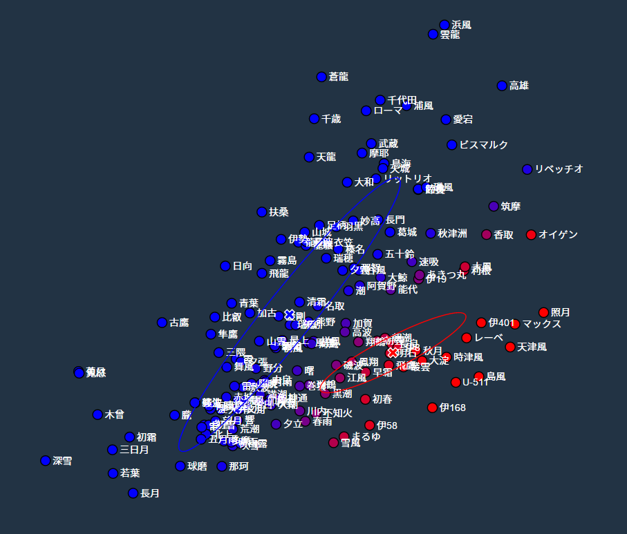

[kammusu-means](https://hakatashi.github.io/kammusu-means/)
=============

「K-means法」と「混合ガウス分布のEMアルゴリズム」をブラウザ上でビジュアライズするやつ

このプログラムは[TSG](http://www.tsg.ne.jp/)の機械学習分科会でのPRML勉強会のデモンストレーションのために制作されました。

## 概要

ゲーム「艦隊これくしょん」の登場人物(艦娘)が画面上にプロットされるので、それらがクラスタリングされる様子をステップごとに見ることができます。PRML第8章のお供にでもどうぞ。

縦軸横軸のパラメーターは、[pixiv](http://www.pixiv.net/)におけるその艦娘の名前と別の単語の共起度を対数スケールにし、平均及び分散を揃えた値になっています。割と適当に収集したのであまり当てにしないでください。生データは[data.json](data.json)に置いてあるのでご自由にどうぞ。

縦軸および横軸に用いる単語は画面下のメニューから自由に選ぶことができます。うまく分類できる組み合わせを探してみてください。(といっても綺麗に分かれるパラメータが一つしか無いのですが……)

クラスタリングの手法には「K-means法」と「混合ガウス分布のEMアルゴリズム」の2種類を用いることができます。どちらも[『パターン認識と機械学習』](http://ibisforest.org/index.php?PRML)(通称PRML)の第8章で解説されているので興味ある方はそちらを読んでください。

## やりたいこと

* クラスタの数を増やせるようにする
* 艦娘一覧のデータがやや古い([kammusu-map](https://hakatashi.github.io/kammusu-map/)で用いてるものと同じ)ので、アップデートする
* 艦隊これくしょん以外のデータでも遊べるようにする

プルリク待ってます()

## 謝辞

構想及び実装において、[にとよん](http://github.com/nitoyon)さんの記事「[K-means 法を D3.js でビジュアライズしてみた](http://tech.nitoyon.com/ja/blog/2013/11/07/k-means/)」を大いに参考にさせていただきました。

## ライセンス

MIT
